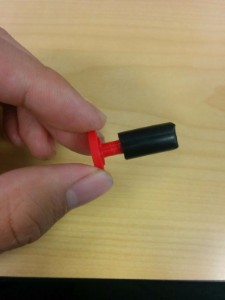
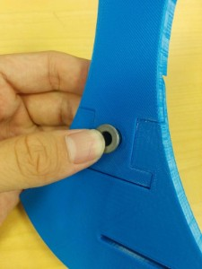
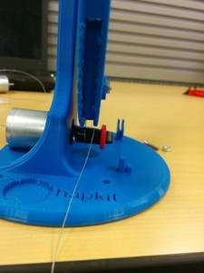
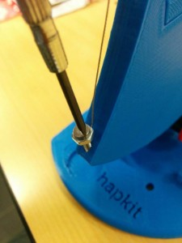
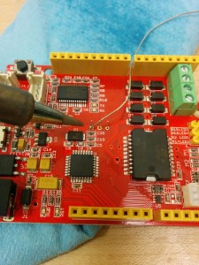
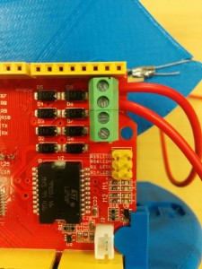
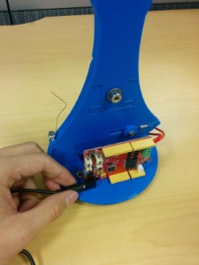

The hAPI: A DEVELOPER’S GUIDE

Getting Started: Device Assembly and INstallation 

A guide to developing haptic simulations with two open-source haptic technologies: The Hapkit and Haply Development Kit. 

Written and Compiled By Colin Gallacher and Steven Ding with contributions from Melisa Orta, Oliver Schneider, Allison Okamura, and Karon MacLean

The hAPI has been initially developed for use in the World Haptics Conference 2017 Student Innovation Challenge. The challenge organizers are Oliver Schneider, Melisa Orta, Colin Gallacher, Allison Okamura, and Karon MacLean. The goal of this Developer’s Guide is to instruct you on the setup and programming of two open-source haptic platforms: the Hapkit and the Haply Development Kit (HDK). The objective is to provide haptics students and enthusiasts with an accessible and transparent way to develop force feedback haptic simulations.

Good luck!

**_**Tip: This document is intended to be viewed online. Make sure View/Print Layout is unchecked in the menu to avoid unwanted page breaks._*** *

*Copyright (C) 2017 Colin Gallacher. Permission is granted to copy, distribute and/or modify this document under the terms of the GNU Free Documentation License, Version 1.3 or any later version published by the Free Software Foundation; with no Invariant Sections, no Front-Cover Texts, and no Back-Cover Texts. A copy of the license is included in the section entitled "GNU Free Documentation License".*

## HAPI SYSTEM INTRODUCTION

With the proliferation of rapid-prototyping tools and open-source development platforms, it is now possible for makers, researchers, and hobbyists to develop their own haptic systems. With the **Haptic API (hAPI)**, it is our attempt to unify prior work that has been done to develop low-cost and accessible haptic systems aimed at lowering the barrier of entry into the field. 

**The hAPI  is an open-sourced haptics application programing interface (API) **that is intended to make prototyping and developing haptic simulations more accessible than it has been before. A major objective for the hAPI is that it allow users to develop and prototype across a number of devices and easily add their own designs to get their simulations up and running quickly. Specifically, its purpose is to provide a platform with which users can become exposed to the basic concepts of a kinesthetic (force-feedback) haptic system. With this platform, we hope you can quickly develop haptic applications using open-source haptic devices such as Hapkit and Haply.

**In this document,** we have documented the hAPI in the context of two open-sourced hardware systems that it has been designed to work with - specifically, the "getting started" stage.

See also hAPI Documentation and Examples for instructions on how to use the hAPI in your haptic simulation development. 

  

**DISCLAIMER**

The following documentation is a work in progress and may possess errors. If any errors are found, please contact Colin at cr.gallac@gmail.com and I’ll be sure to correct the mistake! Thanks!

TABLE OF CONTENTS

[[TOC]]

# 1.	GETTING STARTED

## **1.1.	HAPKIT**

### 1.1.1.	UNBOXING

Hapkit ([http://hapkit.stanford.edu](http://hapkit.stanford.edu)) is a 1-degree-of-freedom force-feedback (kinesthetic) haptic device that can be assembled by haptics novices. The version of Hapkit provided for the World Haptics Conference 2017 Student Innovation Challenge is Hapkit 3.0. Within the kit you will find:

<table>
  <tr>
    <td>1.</td>
    <td>Pivot axis components</td>
    <td>8.</td>
    <td>Hapkit Handle(upper)</td>
  </tr>
  <tr>
    <td>2.</td>
    <td>Capstan drive assembly</td>
    <td>9.</td>
    <td>Hapkit Capstan(lower)</td>
  </tr>
  <tr>
    <td>3.</td>
    <td>Base suction cup assembly</td>
    <td>10.</td>
    <td>Hapkit Base</td>
  </tr>
  <tr>
    <td>4.</td>
    <td>Allen Keys</td>
    <td>11.</td>
    <td>Hapkit and MR encoder</td>
  </tr>
  <tr>
    <td>5.</td>
    <td>Alligator Clips</td>
    <td>12.</td>
    <td>Power supply unit</td>
  </tr>
  <tr>
    <td>6.</td>
    <td>Pivot axis shoulder screw</td>
    <td>13.</td>
    <td>USB cable</td>
  </tr>
  <tr>
    <td>7.</td>
    <td>Motor assembly</td>
    <td></td>
    <td></td>
  </tr>
</table>

### 1.1.2.	DEVICE ASSEMBLY

1. Attach the motor to the base. (a) Place the motor in the base by pushing the motor shaft through the hole as shown below. (b) Use two 4-40 screws with length 3/8" (not the longer screws!) with washers on either side of the motor to secure the motor in place. The height of the motor/screws in the slots doesn't matter much; the slots just make it easier to place the screws. It is easiest to get the second screw in if you don’t tighten the first screw all the way. Once both screws have purchase, then tighten them.

    

1.                                                       (b)

2. Assemble the motor and drive wheel. (a) Insert the 3D-printed drive wheel into the neoprene tube. If your drive wheel is loose within the neoprene, you can use superglue here. (This isn't necessary for most parts, but it may happen due to the tolerance of the 3D-printed parts.) (b) Then place superglue into the magnet holder end of the 3D-printed drive wheel, and insert the magnet. Let dry. When the motor shaft rotates, the cylinder-shaped magnet should rotate about an axis perpendicular to the cylindrical axis of the magnet (c) Apply a small amount of superglue on the motor shaft (d) and then slip the drive wheel over the motor shaft. (d) Let dry for a few minutes.

      

         (a)			               	            (b)			         (c)

 

 (d)			(e)

3.. Assemble the sector pulley. (a) Press to fit your custom-designed handle into the sector pulley. Again, due to the tolerance of the 3D printer, it might be a little loose. You can apply some superglue in this case. (b) With the sector pulley laying flat on the table, insert the bearing into the hole. Press it in so the flange makes solid contact with the sector pulley surface.

   

         (a)				      (b)

(c) Insert the shoulder screw into the bearing. It should turn freely in the bearing. (d) Place the shaft collar over the shoulder screw and (e) use the 3/32" hex key (allen wrench) to securely attach the shaft collar to the bolt (not screw) part of the shoulder screw. (f) After assembly, you should be able to hold onto the screw part of the shoulder screw and freely swing the sector pulley around the bearing.

   

          (c)	                                                    (d)	

  

         (e)	                       		          (f)

4. Attach the sector pulley to the base. (a) Place the shoulder screw (on the sector pulley assembly) into the hole on the base piece. Use the 1/8" hex key (allen wrench) to screw the shoulder screw into the hole on the height adjustment bar. You will be tapping (creating threads in the plastic of the hole) as you screw it in, so be sure to make the screw go in as straight as possible. (b) You need to screw it until a secure attachment is made. As the shoulder screw is screwed in, it will break the little plastic cross on the back of the base.

    

         (a)	                                                      (b)

5. Assemble the cable driving system. (a) Put one end of the cable through the compression sleeve and form a ring. (b) Use the crimping tool to crimp the compression sleeve so that the cable can’t move in the sleeve. (c) Put the other end of the cable through the small hole on the bottom right corner of the sector pulley (when the front side of the sector pulley is facing you). (d) Place the 4-40 3/4’’ screw from the back of the sector pulley through the long slot and the ring at the end of the cable. (e) Put the 3D printed tightening washer and a 4-40 nut on top and tighten it.

   

(a)                                                     (b)                                                       (c)

 

      (d)                                                         (e)

(f) Put a 4-40 nut on the 4-40 1/2'’ screw. (g) Pull the cable along the sector pulley and around the drive wheel for **3** loops. Note that it is important to loop counterclockwise rather than clockwise around the drive wheel. In the end the cable should not generate external torques on the axis of the motor. So it is important to go **counterclockwise.** (This step could be very hard for people with no experience with cable driven systems, be patient and ask for others’ help). (h) Pull the end of the cable through the hole on the other end of the sector pulley. (i) Screw the 4-40 1/2’’ screw with nut in to the hole to fasten the cable.

  

 				      (f)                                                                (g)                               

 

     (h)                                                                  (i)

(j) Tightening the cable by adjusting the position of the 3D printed tightening washer along the slot. (k) Adjust the position of the cable around the drive wheel so that the 3 loops won’t cross over each other when rotating. (l) Adjust the position of the tightening washer again to make sure the cable is tight enough and the sector pulley can rotate smoothly.

  

                                 (j)                                       		 (k)                                       		  (l)

6. Assemble the suction cups. (a) Put the suction cups through the holes on the bottom of hapkit. (b) Put 11/32’’ nuts on the threads of the suction cups to fasten them.

  

       				(a)				(b)

7. Solder the magnetoresistive (MR) sensor to the Hapkit board. (a) There is an outline for where the MR sensor should be placed on the Hapkit board. Place the sensor over the outline, such that the side of the sensor with the writing faces outward. Then tilt the sensor up 90 degrees and place the leads all the way into the holes on the Hapkit board. Fold the sensor down to bend the leads and lay the sensor flat against the board (over the outline). Do this only once, or the leads may fatigue and break. (b) Solder each of the 3 leads of the sensor to the board. (You can find soldering tutorials, such as:[ http://www.instructables.com/id/How-to-solder/step4/Soldering-components-onto-a-circuit-board/](http://www.instructables.com/id/How-to-solder/step4/Soldering-components-onto-a-circuit-board/).)

     

         (a)	 			         (b)

8. Attach the Hapkit board to the 3D-printed base and connect to motor. (a) There are two fixtures on the 3D printed base to fit the Hapkit board. Place the board on the fixtures as shown below. (b) Cut the wire with alligator clips in half, using wire stripper to strip the end of wires. (c) Use the screwdriver to unscrew the top two terminals on the right side of the Hapkit board. This will open up holes on the right side of the terminal block so you can insert the stripped wire end of the motor leads. Insert a lead into each hole. Twist the leads to get them into the holes, then tighten the terminals. (d) Attach the alligator clips on the other ends of the leads to the motor. The lead that is attached to the top terminal screw (labeled M+ on the other side of the Hapkit board) should connect to the lead on the motor with the red dot near it.

 

  (a)			               	        (b)	

        (c) 			                      (d)

9. Final electronic connections. (a) Insert the "micro" end of the USB cable to the connector on the Hapkit board. Hold on to the board with your other hand while you do this. Be very careful during insertion and removal of the USB cable, since (depending on where you get your USB cable), it can be a very tight fit. Warning: It is possible to yank the USB connector off the Hapkit board! (b) Insert the power supply cable (coaxial connector) into the corresponding connector on the Hapkit board.

 

		   (a)				          (b)				           (c)

(c) When you plug the other end of the USB connector into your computer, you should see a green light on your Hapkit board. This tells you that the basic power functions of the Hapkit board are working. (You do not need to plug the power supply into the wall until you want to use the motor, so to avoid unintended motor commands, we suggest you wait to power the motor until you are ready to test it.)

Congratulations – you have successfully assembled your Hapkit. Now you can start programming!

The Hapkit 3.0 assembly instructions can also be found here:

[http://hapkit.stanford.edu/files/HapkitAssemblyInstructions_v11_11_15.pdf](http://hapkit.stanford.edu/files/HapkitAssemblyInstructions_v11_11_15.pdf)

### [1.1.3.	ARDUINO IDE SETUP](http://hapkit.stanford.edu/files/HapkitAssemblyInstructions_v11_11_15.pdf)

How to configure the Arduino IDE: Step by step guide

#### 1.1.3.1.	Installation

1. Download and install the Arduino IDE from the following link:[ https://www.arduino.cc/en/Main/Software](https://www.arduino.cc/en/Main/Software). In the download options, please download the local IDE rather than the online IDE. For windows users, installation is easiest and quickest using the windows installer option. For other OS users, please download the relevant version for your computer. 

2. After installing the Arduino IDE, we can now connect the Hapkit to the computer. When you first connect the Hapkit to the computer, please allow a few minutes for the proper device drivers to install. After the drivers have been successfully installed, open an IDE window or a Hapkit firmware example. To ensure the Arduino IDE knows what type of board is being programmed, please select the Arduino/Genuino Uno board option by selecting the tab: 

Tools > Board > Arduino/Genuino Uno

**	**

3. Now we can select the port that the Hapkit development board is connected to the computer on the IDE. If the Hapkit is the only device connected to the computer, this step may be automatic. As an example for Windows users in selecting the port for the Hapkit, start by selecting the tab:

	Tools > Port > COM27 

In this example, the Hapkit board is connected to the computer on COM27. 

**	**

**	**

### **1.1.4.	PROCESSING**

1. After setting up for Arduino, download Processing from the link below:[ https://processing.org/download/
](https://processing.org/download/)You will be using Processing to work on your Haptics project.

**Note* please ensure the version of Processing that you are downloading matches the version of Java **

**installed on your machine. (if you have an 32-bit version of Java installed download the 32-bit version of Processing, if you have an 64-bit version of Java installed download the 64-bit version of Processing) Not doing so will result in simulation slow downs and instabilities.  **

2.   If the hAPI library was not included in your processing project, or you need to include the hAPI library again, start by choosing the Sketch tap and choosing Add File.

This will bring up a new folder window. Navigate to your project location and select the hAPI.jar file as the file to include. By selecting this file, Processing will create a new folder called ‘code’ in your project folder, the hAPI library has been included in your project.

 

### **1.1.5.	Running a haptic simulation**

Now that all your development software is setup, let us go through the steps needed to run an example haptic simulation. Open up the Arduino IDE and open the Hapkit firmware contained in your distributed folder at the path:  "*.../hAPI/Hapkit/Arduino/Hapkit_arduino.ino"*. 

Once we’ve opened up the Hapkit firmware within the Arduino IDE we we should first click the checkmark to verify that the code can be compiled. Upon verification, we should ensure we’ve selected the appropriate *Board *and *Port *in the tool menu. 

Before uploading the firmware, which initializes the board position upon starting, please ensure that your Hapkit is in the vertical position. Click the right-facing arrow to upload the Hapkit firmware to the Hapkit. It should take a couple seconds but upon completion the log will read, "*done uploading", *if everything works smoothly. Now the Hapkit  is ready to be used with one of the example simulations. 

Before starting any haptic simulations using the Haply system, make sure your device is set in the proper initial position. Make sure your device is plugged into the wall using the included 12 V power supply unit. 

Now you can navigate to the example folder contained with the distributable at the path: "*.../hAPI/Hapkit/Processing/examples/HelloWall". *Within this folder you’ll find the *hAPI.jar *file which allows us to access the functions within the hAPI. There will also be a *FirstContact.pde *file which is a simulation of what it’s like to touch a virtual wall and can show the force of contact. If you open this file you can set your device in the initialization configuration and then click the *play* button. This will run your first simulation! Feel free to explore the other examples included!

****note: For Mac users, you may find that the simulation will load but not be controllable. If this is the case, replace the board initialization line (eg. line 86 in the HelloWall example) to include your computer’s serial port (Under the Port tab in Arduino) that Arduino is using eg. /dev/cu.usbmodem1411. Where to find this information and the change to make to the HelloWall example is shown below.**

****note: if the serial port does not close down properly, you can experience a problem where the simulation will not load. If this happens we suggest you unplug the Hapkit Board from the computer, unplug the power supply, and close the Processing window. Replugging in the Hapkit Board and reopening the Processing sketch solve the majority of problems. **

## 1.2.	THE HAPLY DEVELOPMENT KIT (HDK)

### 1.2.1.	UNBOXING

Haply (http://www.haply.co) is a 2-degree-of-freedom kinesthetic (force feedback) haptic device designed to be assembled by haptics novices. Within the kit you will find: 

<table>
  <tr>
    <td>1.</td>
    <td>1x Acrylic top plate</td>
    <td>10.</td>
    <td>1x Haply development board</td>
  </tr>
  <tr>
    <td>2.</td>
    <td>1x 3D printed motor stand</td>
    <td>11.</td>
    <td>2x plastic joints and 1x  end-effector handle</td>
  </tr>
  <tr>
    <td>3.</td>
    <td>1x 3D printed motor housing</td>
    <td>12.</td>
    <td>2x Dev board extension wiring</td>
  </tr>
  <tr>
    <td>4.</td>
    <td>1x 3D printed development board housing</td>
    <td>13.</td>
    <td>11 x 2-56x ¼ Inch screws and 6x #2 washers</td>
  </tr>
  <tr>
    <td>5.</td>
    <td>1x Acrylic bottom plate</td>
    <td>14.</td>
    <td>4x M2/ 5 mm screws </td>
  </tr>
  <tr>
    <td>6.</td>
    <td>2x Motors</td>
    <td>15.</td>
    <td>1x Wire adapter board</td>
  </tr>
  <tr>
    <td>7.</td>
    <td>4x Acrylic motor linkages</td>
    <td>16.</td>
    <td>1x USB cable</td>
  </tr>
  <tr>
    <td>8.</td>
    <td>4x Suction cup feet</td>
    <td>17.</td>
    <td>1x Power supply</td>
  </tr>
  <tr>
    <td>9.</td>
    <td>2x Aluminum motor hubs</td>
    <td></td>
    <td></td>
  </tr>
</table>

### 1.2.2.	DEVICE ASSEMBLY 

Step by step guide how to assemble the device

Part A. Assemble the Base

1. Peel off the wrapping paper from the acrylic top plate (item 1)

2. Fix the motor stand (item 2) onto the the top plate. No screws required

3. Screw the bottom board housing (item 4) to the plate.

4. Screw the top stand to the bottom board housing.

Part B. Assemble the Motors and Linkages

5. Insert the motors (item 6) to the motor housing (item 3). Make sure the motors are pushed all the way to the bottom.

6. Align the holes from the motor housing with the screw holes on the motors and use four M2/5mm (item 14) screws to fix the motors to the motor housing. 

7. Scratch to peel the paper off the motor linkages (item 7).

8. Connect two different shapes of the linkages together using white linkage joints (item 11). The smaller side of linkage A are aligned to joint. *Caution: test the size of the hole on linkage B using the ¼ inch threaded metal insert (item 19), if the hole fits the metal screw cap, then use the other side to joint.

9. Connect two linkages to create the handle (end-effector) using the threaded metal insert (item 19), the acrylic linkages(item 20) and the rubber ring (item 21). The rubber ring will be a bit of a tight fit so we recommend holding the rubber just above the threaded metal insert and screwing the nylon bold into the hole on the black rubber ring.  You can use *[locktite* ](http://www.loctiteproducts.com/p/t_lkr_blue/overview/Loctite-Threadlocker-Blue-242.htm), or some other non-proprietary thread glue to prevent loosening of the joints. 

10. Screw the motor hub (item 9)  to the linkages using the 2-56 ¼" screws (item 13).

11. To screw the motor hub onto the motor, the flat part on the motor (marked blue) has to align with the set screw hole on the motor hub.

12. Leave a certain space between the motor and the hub now, you can adjust it so that when all assembled, the end point touches the base plate. Align both hubs at the same height.

13. Insert and screw the black set screws (item 18) to the hole to hold the motor. Again, you can use *[locktite* ](http://www.loctiteproducts.com/p/t_lkr_blue/overview/Loctite-Threadlocker-Blue-242.htm), or some other non-proprietary thread glue to prevent loosening of the joints. ****WARNING: sometimes this screw can become loose with usage. This is an incredibly annoying bug to solve as the motor will rotate inside of the motor hub freely. One of the arms will appear to stop working as movement of the device will not cause the encoder to pick up any movement. Make sure these set screws are tightened properly. **

14. Make sure the round part of the motor housing is facing forward as shown below.

15. Make sure the orientation of the wire adaptor board (item 15) is right: the two ports  are on the top and point upward  (The "M+" label on the edge of the board should be at the top). 

16. Screw the adaptor board and the motor housing together onto the stand.

Part C. Assemble the Haply Development Board

17. Put the Haply development board (item 10) in the board housing. Make sure the sides are aligned with the opening.

18. Screw the bottom plate (item 5) to the board housing using the suction cup feet (item 8).

19. **(**Caution**) The adapter board wire ports can be a bit delicate. **Connect the wires of the motor to the top two ports on the wire adaptor board. Gently wiggle the connectors into the adapter board if they are tough to connect. If you plan on using the encoders that are built into the motor, ensure that the slide switch on the adapter board is positioned on the side labeled "en" for encoders. 

20. Connect the two dev board extension wiring (item 12) from the the bottom two ports of the wire adaptor board to J2, J3 ports on the Haply development board.

21. Using super-glue the circular cutout to the lower height arm ~1.5 cm from the end-knob. This will prevent the device from moving into undesirable configurations, called singularities. 

Now you are ready to use the device!

### 1.2.3.	ARDUINO IDE SETUP

How to configure the Arduino IDE: Step by step guide

#### 1.2.3.1.	Installation

1. Download and install the Arduino IDE from the following link:[ https://www.arduino.cc/en/Main/Software](https://www.arduino.cc/en/Main/Software). In the download options, please download the local IDE rather than the online IDE. For windows users, installation is easiest and quickest using the windows installer option. For other OS users, please download the relevant version for your computer. 

2. Install the core needed for the Arduino Due. Open the Arduino IDE and click on the Tools menu, then Boards>Boards Manager.

3. From the opened board manager, select the "Arduino SAM Boards (32-bits ARM Cortex-M3) by Arduino" core, choose version 1.6.11 in the drop-down menu and click install. (Picture shown below is after installation) ****note: this step may be skipped for mac users**

4.  After installing the Arduino IDE and the Arduino Due core support, connect the Arduino Due to your computer using a USB cable via the Native USB port.

5. For Windows, driver installation is required. Click "windows + x", a list will appear on the left hand side. Click “Device Manager”.

6.  Look for the listing named "Ports (COM & LPT)". Depending on your Windows Software and drivers configuration you will see “Bossa Programming Port” or “Unknown Device” or any other similar thing. 

7. Right click on that and choose "Update Driver Software". The picture shown below (Arduino Due COM4) is after installation. 

8. Select the "Browse my computer for Driver software" option.

9. Navigate to the folder with the Arduino IDE you downloaded and unzipped earlier. Locate and select the "Drivers" folder in the main Arduino folder (NOT the “FTDI USB Drivers” sub-directory). Press “OK” and “NEXT” to proceed. (If you are prompted with a warning dialog about not passing Windows Logo testing click “Continue Anyway”.)

10. In the Device Manager, you should now see a port listing similar to "Arduino Due Programming Port (COM4)". (the COM number will change depending on devices connected to your computer)

11.  Now you are ready to upload code to the Due/Haply board. Remain the connection of  your board to the computer and open the Arduino IDE if it is not already open.

12. In the Tools menu tab, choose "Port" and select the serial port of the DUE. (COM4(Arduino Due(Native USB Port)))

13. Again in the Tools menu tab, choose "Boards" and select “Arduino Due (Native USB Port)”.

14. To be able to compile and upload the code onto the board, you need to download the two libraries needed from the link below:[ https://drive.google.com/drive/folders/0Bxt_y6pIhiprQ0ZLX1NuWmlVTTg](https://drive.google.com/drive/folders/0Bxt_y6pIhiprQ0ZLX1NuWmlVTTg). The libraries are also included with the distributed hAPI folder at the path ".../hAPI/HaplyDevKit/Arduino/libraries".

15.  Unzip Encoder and PWM

16. Navigate to Documents > Arduino > libraries, then copy both Encoder and PWM and paste them here

17. Open Haply_Arduino_Control.ino in Arduino, verify and upload it to the board. Now you are ready to work on your Haptic project.

### 1.2.4.	PROCESSING 

18. After setting up for Arduino, download Processing from the link below:[ https://processing.org/download/](https://processing.org/download/)
You will be using Processing to work on your Haptics project.

**Note* please ensure the version of Processing that you are downloading matches the version of Java **

**installed on your machine. (if you have an 32-bit version of Java installed download the 32-bit version of Processing, if you have an 64-bit version of Java installed download the 64-bit version of Processing) Not doing so will result in simulation slow downs and instabilities.  **

19.  If the hAPI library was not included in your processing project, or you need to include the hAPI library  again, start by choosing the Sketch tap and choosing Add File.

This will bring up a new folder window. Navigate to your project location and select the hAPI.jar file as the file to include. By selecting this file, Processing will create a new folder called ‘code’ in your project folder, the hAPI library has been included in your project.

If you’re planning on developing examples in Processing, you must first import the CountdownTimer library developed by Dong Hyun Choi. This library allows us to control the rates at which we run our simulations. Navigate to the *Sketch*/*Import LIbrary/Add LIbrary *menu. Click on Add LIbrary to open up the Contribution Manager. 

Once in the *Contribution Manager* type "CountdownTimer" into the search bar. Select The *CountdownTimer* library and then click Install.  

Now you’re all set to develop your haptic simulation! To sample an example application go to the following section.

### **1.2.5.	Running a haptic simulation**

Now that all your development software is setup, let us go through the steps needed to run an example haptic simulation. Open up the Arduino IDE and open the Haply firmware contained in your distributed folder at the path:  "*.../hAPI/HaplyDevKit/Arduino/Haply_Arduino_Control.ino"*. At this point you should have already installed the necessary PWM and Encoder libraries into your *.../Arduino/libraries *directory. You’ll need these libraries to flash the firmware onto the Haply Dev Board. 

Once we’ve opened up the Haply firmware within the Arduino IDE we we should first click the checkmark to verify that the code can be compiled. Upon verification, we should ensure we’ve selected the appropriate *Board *and *Port *in the tool menu. 

Click the right-facing arrow to upload the Haply firmware to the Haply Dev Board. It should take a couple seconds but upon completion the log will read, "*done uploading", *if everything works smoothly. Now the Haply Dev Board is ready to be used with one of the example simulations. 

Before continuing onto the Processing side, please ensure that your Haply pantograph is setup at the initial position shown in the figure below. Before starting any haptic simulations using the Haply system, make sure your device is set in the proper initial position. Make sure your device is plugged into the wall using the included 6.5 V power supply unit. 

Each time a new simulation is started, the device should be returned to this initialization configuration. This allows for us to calibrate the device. Often if you witness odd behaviour during your simulation it can be attributed to forgetting to initialize your device. 

Now you can navigate to the example folder contained with the distributable at the path: "*.../hAPI/Haply/Processing/examples/HelloWall". *Within this folder you’ll find the *hAPI.jar *file which allows us to access the functions within the hAPI. There will also be a *HelloWall.pde *file which is a simulation of what it’s like to touch a virtual wall. If you open this file you can set your device in the initialization configuration and then click the *play* button. This will run your first simulation! Feel free to explore the other examples included!

****note: For Mac users, you may find that the simulation will load but not be controllable. If this is the case, replace the board initialization line (eg. line 86 in the HelloWall example) to include your computer’s serial port (Under the Port tab in Arduino) that Arduino is using eg. /dev/cu.usbmodem1411. Where to find this information and the change to the HelloWall example is shown below.**

****note: sometime if the serial port does not close down properly you can experience a problem where the simulation will not load. If this happens we suggest you unplug the Haply Board from the computer and close the Processing window. Replugging in the Haply Board and reopening the Processing sketch solve the majority of problems. **

